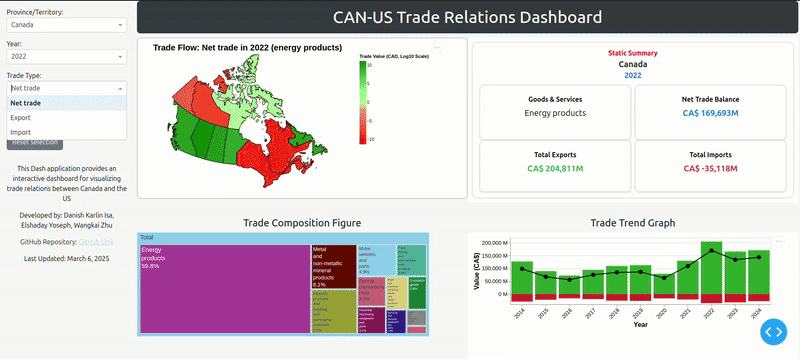
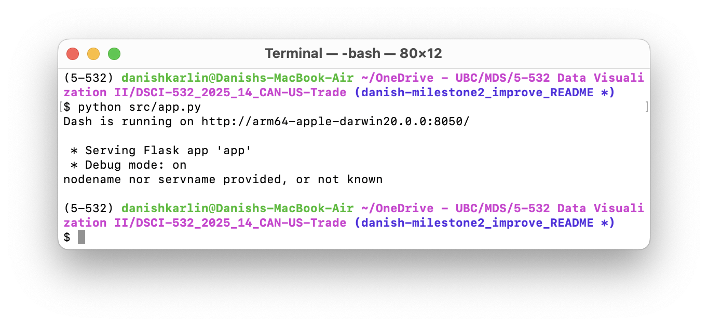

# Canada-U.S. Trade Relations Dashboard

Welcome to the Canada-U.S. Trade Relations Dashboard repository!



## About our dashboard

### The problem

In January 2025, the Trump administration of the United States sought to impose a flat 25% tariff on nearly all imported goods from Canada due to grievances with border control. With the United States being Canada's top trading partner by export value, this announcement sent shock waves throughout Canada and the US, with government officials and economists sounding alarm bells on its potentially devastating impact on the economies on both sides of the border.

Due to the severity of this situation, economic analysts in Canada must quickly assess industries and provinces will be most affected, the magnitude of trade reductions, and the long-term economic impact. However, trade data is often complex and hard to interpret, making it difficult to derive practical insights efficiently.

### Our solution

Our goal is to develop an interactive dashboard that visualizes trade relations between Canada and the United States. The informative dashboard will help economic analysts by making trade data more interpretable with interactive figures. This will allow them to explore historical trade trends and assess vulnerabilities so that more time can be devoted to implementing measures to mitigate the impact of the tariffs on the Canadian economy.

Aside from economic analysts, our interactive dashboard will also make trade data more accessible for anyone who is interested in learning more about Canada's economic relationship with the US.

## About us

This dashbaord is developed by Danish Karlin Isa, Elshaday Yoseph and Wangkai Zhu, who are Master of Data Science students at the University of British Columbia.

This project is part of the coursework for DSCI 532 Data Visualization II, a course of the Master of Data Science program at the University of British Columbia.

## Facing a issue with our dashboard?

We'd love to know! Please create a new Issue under the Issues tab, and we will get back to you as soon as possible.

## Interested in contributing to this dashboard?

Thank you for your interest! You can find:

-   instructions on how to get our dashboard on your computer below,
-   instructions on how to submit your contributions to us below, and
-   information regarding contributing to this dashboard in [CONTRIBUTING.md](https://github.com/UBC-MDS/DSCI-532_2025_14_CAN-US-Trade/blob/main/CONTRIBUTING.md).

### Developer notes

#### Dependencies

-   Python 3.11.11 or later,
-   Conda 24.11.3 or later, and
-   All packages found in `environment.yaml`.

#### Running our dashboard locally on your computer

1.  Clone this GitHub repository.

2.  Install our `conda` environment by running the following command-line command:

```{bash}
conda env create -f environment.yml
```

3.  Activate our `conda` environment by running the following command-line command:

```{bash}
conda activate 532
```

4.  Using a command-line interface, navigate to the root directory of the cloned repository and run the folling command-line command:

```{bash}
python src/app.py
```

5.  Take note of the link shown in the terminal output (example shown below) and navigate to that link using any Web browser on the same computer.



#### Contributing to our dashboard

We always welcome new ideas! Here's how you can contribute to our dashboard:

1.  Clone this dashboard into your computer using the instructions above.

2.  Create a new branch and make your changes.

3.  Once it's looking good, push your branch to remote and create a Pull Request.

4.  We will review your improvements using through the Pull Request. Once accepted, we will merge your changes into our dashboard!

## License

The dataset used in our dashboard is obtained from Statistics Canada (StatCan). It is licensed under the [Statistics Canada Open License](https://www.statcan.gc.ca/en/reference/licence), where there are no restrictions on the use of the dataset for sharing or redistribution for both commercial and non-commercial purposes, provided that the appropriate credit is given.

The software code contained within this repository is licensed under the MIT license. See the [LICENSE](https://github.com/UBC-MDS/DSCI-532_2025_14_CAN-US-Trade/blob/main/LICENSE) file for more information.