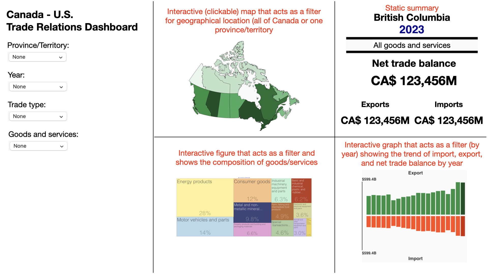

## Motivation and Purpose

### About us

We are a team of data scientists who are interested in international economy and trade.

### Our target audience

Our primary users are economic analysts and trade policy experts who need to evaluate the impact of trade policies, such as tariffs, on Canadian industries and provinces. Specifically, we hope that our interactive visualisations will benefit professionals in government agencies, research institutions, and trade organizations who are interested in studying the impact of the proposed tariffs.

### The problem statement

The recent announcement of a 25% tariff on Canadian imports into the United States [@tariff-news] has raised concerns about its potential economic consequences on both sides of the border. Economic analysts must quickly assess which industries and provinces will be most affected, the magnitude of trade reductions, and the long-term economic risks. However, trade data is often complex and hard to interpret, making it difficult to derive practical insights efficiently.

### What we plan to accomplish

Our goal is to develop an interactive dashboard that visualizes trade relations between Canada and the United States. The informative dashboard will help economic analysts explore historical trade trends, assess vulnerabilities, and simulate potential disruptions caused by tariffs.

Our Canada-US Trade Relations Dashboard solves this problem by consolidating 10 years of trade data into an intuitive and interactive platform. Key features include:

-   Visualizing Canada-U.S. trade flows via maps, treemaps, and time-series charts.
-   Comparing industry-specific vulnerabilities with breakdowns by goods categories and export values.
-   Providing statistical trends to support policymakers in making informed countermeasures.

With this dashboard, economic analysts can rapidly assess risks, generate insights, and propose effective trade strategies, ensuring Canada remains competitive in the face of evolving trade policies.

## Description of the data

### The dataset

The dataset used in our dashboard is obtained from Statistics Canada (StatCan). It describes Canadian international merchandise trade by province and country, and by product sections [@dataset]. The dataset is licensed under the Statistics Canada Open License [@statcan_license], where there are no restrictions on the use of the dataset for sharing or redistribution for both commercial and non-commercial purposes.

The dataset contains 2,441,712 entries with 17 columns. This corresponds to data obtained from 1999 to 2024, where each row describes the amount of trade by province, trading partner and type of goods and services.

The description of the original dataset can be seen in @tbl-original-dataset below.

| Column | Description | Notes |
|:-----------------|:------------------------------------|:-----------------|
| `REF_DATE` | Reference period of time of interest |  |
| `GEO` | Geographic area of interest (either Canada or a Canadian province/territory) |  |
| `DGUID` | Dissemination Geography Unique Identifier assigned by StatCan to all geographic areas in Canada | To be dropped |
| `Trading partner` | Trading partner of `GEO` |  |
| `North American Product Classification System (NAPCS)` | Category of goods and services of interest |  |
| `Trade` | Either `Import` or `Export` |  |
| `UOM` | Unit of measurement of `VALUE` | To be dropped |
| `UOM_ID` | Unique identifier code of `UOM` | To be dropped |
| `SCALAR_FACTOR` | Scaling factor that should be multiplied to `VALUE` |  |
| `SCALAR_ID` | Unique identifier code of `SCALAR_ID` | To be dropped |
| `VECTOR` | Time-series identifier | To be dropped |
| `COORDINATE` | Concatenation of several ID values | To be dropped |
| `VALUE` | Value of `Trade` with `Trading partner` for year `REF_DATE` with units `UOM` and scaling factor `SCALAR_FACTOR` |  |
| `STATUS` | Status of data point | To be dropped |
| `SYMBOL` | Revision status of data point | To be dropped |
| `TERMINATED` | Whether data point is no longer updated by StatCan | To be dropped |
| `DECIMAL` | Decimal precision of `VALUE` | To be dropped |

: Description of the dataset obtained from StatCan {#tbl-original-dataset}

### How we are using the dataset

We aim to only make use of a subset of the original dataset for our dashboard. The modifications made to the original dataset mainly involves renaming of columns to be more computer-readable and multiplying columns to ensure all values are not scaled.

The proposed set of columns that will be used in our dashboard is described in @tbl-dashboard-data below.

| Column | Reference to original dataset | Description |
|:--------------|:---------------|:-----------------------------------------|
| `year` | `REF_DATE` | Year of interest |
| `geo` | `GEO` | Geographic area of interest (either Canada or a Canadian province/territory) |
| `partner` | `Trading partner` | Trading partner of `GEO` |
| `category` | `North American Product Classification System (NAPCS)` | Category of goods and services of interest |
| `trade` | `Trade` | Either `Import` or `Export` |
| `value` | `VALUE` \times `SCALAR_FACTOR` | Value of `trade` in `year` between `geo` and `partner` involving `category` in Canadian dollar (CA\$) |

: Description of the data that will be used in our dashboard {#tbl-dashboard-data}

With the modified dataset, we will be able to derive new values of interest, which may include percentage composition of trade by type of goods, or year-on-year change in trade value for a particular province.

## Research questions and usage scenarios

### Persona of the target audience

John Miller, a senior trade policy analyst with the Government of Canada's Trade Commissioner Service, is tasked with evaluating the economic impact of potential U.S. tariffs on key Canadian industries. With the recent announcement of a 25% tariff on Canadian exports, he needs to understand which industries and provinces will be most affected, the projected decline in trade, and the broader economic implications. His goal is to provide data-driven recommendations to policymakers on possible countermeasures and support programs for affected sectors.

### Overall goal of our persona

John wants to use the dashboard to understand the impact of a 25% tariff on Canada’s exports to the United States and identify which industries and provinces will experience the greatest disruptions.

### Walkthrough of our persona with our dashboard

#### Explore the overall trade relationship between Canada and the U.S.

-   Instead of exploring the data and manually creating charts in Microsoft Excel, John uses our interactive map displaying Canada’s exports, imports, and net exports with the U.S.
-   He can switch between total exports, imports, and net export balance using interactive filters.

#### Compare different industries to assess vulnerability

-   A treemap visualization shows Canada’s exports to the U.S. by industry, helping him quickly identify which sectors contribute the most to trade.
-   He notices that some industries, like energy and manufacturing, dominate the export market.

#### Identify the impact of the potential tariffs by province

-   A provincial map visualization allows John to see how different provinces contribute to exports and which regions are most dependent on trade with the U.S.
-   He switches to a province view, where visualizations within each province help break down trade composition, making it easier to see which industries are at risk in each province.

#### Report findings and propose countermeasures

-   John writes a report with key insights and visualizations to present to policymakers.
-   He drafts a proposal advising potential countermeasures, such as export diversification strategies or subsidies for affected industries.

### Outcome

With this dashboard, it would be easier for John to gain insights into current trade patterns between Canada and the U.S. so that he can quickly propose recommendations to policymakers, ensuring proactive economic strategies that mitigate risks from a potential trade war.

## App sketch and brief description

{#fig-sketch}

## References